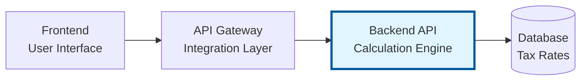
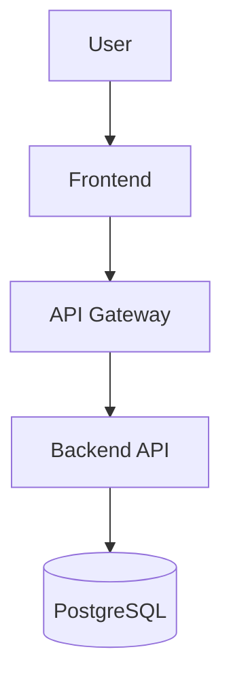
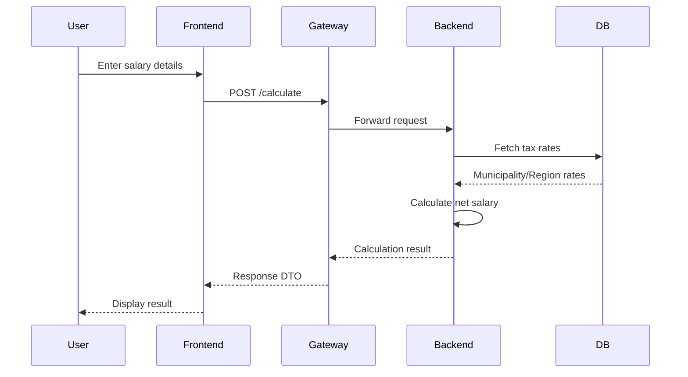
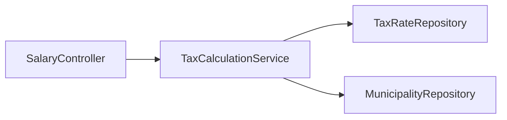
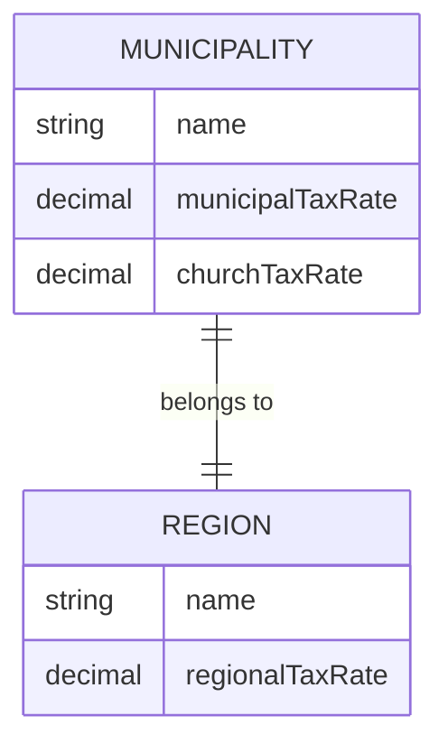

# Master Prompt for System Documentation

> **Purpose**: This document contains the master prompt used to generate or update `docs/system-overview.md`.  
> **Usage**: Use this prompt when creating comprehensive system documentation or when major architectural changes require documentation updates.  
> **Last Updated**: `2025-12-29`  
> **Scope**: **Backend API** (calculation engine) - one of three components in the NettoApi system

---

## Philosophy

**Documentation should explain WHY the system is built as it is, not catalog every implementation detail.**

- Focus on architectural decisions and trade-offs
- Document flows and interactions, not exact implementations
- Keep concepts stable, let code be the source of truth for details
- Reference code files for specifics (versions, schemas, configurations)

---

## Documentation Scope

### What This Document Covers

This master prompt generates documentation for the **Backend API** component only. The documentation should:

| Aspect | Coverage Level |
|--------|---------------|
| **Backend API architecture** | Full detail - layers, services, repositories |
| **Business logic & calculations** | Full detail - tax rules, domain model |
| **Database design** | Full detail - entities, relationships |
| **System context** | Brief overview - how this API fits in the larger system |
| **API Gateway** | Context only - mention role, not implementation |
| **Frontend** | Context only - mention role, not implementation |

### Cross-Project References

Each component has its own documentation:
- **Backend API** (this project): `demo/.github/` and `demo/docs/`
- **API Gateway**: (separate repository with own documentation)
- **Frontend**: (separate repository with own documentation)

The system overview diagram appears in all three projects for context, but detailed documentation lives in each respective project.

---

## Overview

You are tasked with creating high-level system documentation for **NettoApi** - a Swedish salary and tax calculator system.  
Generate or update a `docs/system-overview.md` file that remains stable over time by focusing on architectural concepts rather than implementation details.

### System Purpose

NettoApi is a web application where users can input their salary, municipality (kommun and region), pensioner status, and Swedish Church membership to receive a calculated net salary.

The application considers relevant tax components such as:
- **Municipal tax** (kommunalskatt)
- **Regional tax** (regionskatt)  
- **Church tax** (kyrkoavgift) - applies to Swedish Church members
- **Pensioner adjustments** - different rules may apply

Results are presented clearly showing gross salary, total taxes, and net salary without requiring users to understand the underlying calculation rules.

### System Architecture Overview

> **Note**: This section provides context for how the Backend API fits into the larger system. 
> Detailed documentation for API Gateway and Frontend lives in their respective repositories.

The system consists of three main components designed with enterprise-grade separation of concerns:



| Component | Responsibility | Documentation |
|-----------|---------------|---------------|
| **Backend API** (this project) | Centralized calculation and business logic. All tax rules, percentages, and assumptions reside here. | **This repository** |
| **API Gateway** | Integration layer between frontend and backend. Provides stable, user-facing API contracts. | Separate repository |
| **Frontend** | Input collection and result presentation. Basic validation only. No business logic. | Separate repository |

### Key Design Principles

- **Centralized business logic**: All calculation and rule-based logic resides in the backend
- **Separation of concerns**: Frontend handles input/presentation, Gateway handles integration, Backend handles calculation
- **Maintainability**: Tax rules, percentages, and assumptions can be changed without affecting the UI
- **Stable API contracts**: Clear interfaces between components for long-term maintainability
- **Enterprise-inspired architecture**: Demonstrates patterns used in government and large-scale solutions

---

## Required Sections

### 1. System Overview
- Brief description of the system's purpose and core functionality
- Target users and primary use cases
- Key business value propositions

### 2. Architecture Overview
- High-level architecture diagram (Mermaid)
- Three-tier architecture: Frontend → API Gateway → Backend API
- Layer descriptions and responsibilities
- Separation of concerns explanation

### 3. Technology Stack
**Focus on choices and rationale, not versions**
- Core framework (Spring Boot + relevant starters)
- Database technology and why
- Key architectural libraries (JPA, validation, etc.)
- **Note**: For specific versions, reference `pom.xml`

**What to include:**
- Technology choices and their rationale
- Major trade-offs
- External service integrations

**What to avoid:**
- Exact version numbers (these change frequently)
- Exhaustive dependency lists (`pom.xml` is source of truth)
- Configuration details (reference `application.properties` instead)

### 4. Core Components
**Focus on responsibilities and relationships, not implementations**

For each major component:
- Component name and purpose
- Responsibilities and boundaries
- Key interfaces and contracts (conceptually, not full signatures)
- Dependencies and relationships
- Mermaid diagram showing component structure

**What to include:**
- High-level service responsibilities (e.g., "TaxCalculationService handles all net salary calculations")
- Component interactions and dependencies
- Separation of concerns between layers

**What to avoid:**
- Exact method signatures (these change with refactoring)
- Implementation details (algorithm specifics, data structures)
- Property lists from entities (code is source of truth)

### 5. Data Flow & Key Scenarios
**Focus on interactions and business flows, not implementation**

- Salary calculation flow (Mermaid sequence diagram)
- Tax rate lookup flow
- Error handling approach

**What to include:**
- Sequence diagrams for critical user journeys
- How layers interact for key scenarios
- Decision points and branching logic

**What to avoid:**
- Line-by-line code walkthroughs
- Every possible edge case
- Implementation-specific error handling (try-catch blocks)

### 6. Domain Model
**Focus on concepts and relationships, not exact structure**

- Core entities and their relationships (Mermaid ER diagram)
- Key domain concepts
- Business rules that drive design

**What to include:**
- ER diagram showing entity relationships
- Domain concepts and their meaning
- Critical business rules

**What to avoid:**
- Complete entity property lists (code is source of truth)
- Validation rules (these belong in DTOs/validators)
- JPA annotations and constraints (check entity files)

### 7. Key Design Decisions & Trade-offs
**Document WHY choices were made**

For major decisions, document:
- The decision that was made
- Alternatives considered
- Rationale for the choice
- Trade-offs and limitations

**Examples:**
- "Why centralized calculation in backend?"
- "Why API Gateway pattern?"
- "Why store tax rates in database vs. configuration?"

**What to include:**
- Context for the decision
- Pros and cons of the chosen approach
- Known limitations

**What to avoid:**
- Justifying every small implementation detail
- Defending decisions without acknowledging trade-offs

### 8. Integration Points
**Document how this API integrates with other components**

> Focus on the Backend API's perspective. Gateway and Frontend internals are documented elsewhere.

**What to document:**
- **Incoming**: What requests does this API receive? (from API Gateway)
- **Outgoing**: What does this API depend on? (Database)
- **Future**: Potential external integrations (Skatteverket data)

**What to include:**
- API contract this service exposes (conceptually)
- Database dependencies
- Communication patterns (REST, etc.)

**What to avoid:**
- API Gateway internal implementation
- Frontend implementation details
- Connection strings and endpoints (reference config)
- API keys or credentials

### 9. Known Limitations & Technical Debt
**Be honest about current state**

- Current architectural limitations
- Known technical debt
- Planned improvements
- Trade-offs that affect functionality

### 10. Glossary
**Define domain and technical terms**

- Domain-specific terms (Swedish tax terminology)
- Technical abbreviations
- Business concepts unique to this system

---

## Sections NOT Required

The following sections are **NOT needed** as they create maintenance burden without adding value:

- ❌ **Detailed Database Schema** - Code and migrations are source of truth
- ❌ **Testing Strategy Details** - Test code shows the approach
- ❌ **Deployment Pipeline Steps** - CI/CD configs are source of truth
- ❌ **Environment Setup** - README.md handles this
- ❌ **API Endpoint Lists** - Code and OpenAPI/Swagger are source of truth
- ❌ **Configuration Examples** - Config files are source of truth

**Instead, reference the actual files** where this information lives.

---

## Documentation Guidelines

### Content Quality
- **Use Mermaid diagrams extensively** for visual clarity
- **Keep language clear and concise** - avoid jargon when possible
- **Focus on "why" decisions were made**, not just "what" exists
- **Include conceptual examples**, not production code
- **Reference actual code files** for implementation details
- **Update the "Last Updated" date** at the top
- **Add a changelog** for tracking major updates

### The "Stability Test"
Before adding detail, ask: **"Will this still be true in 6 months?"**

- ✅ **Stable**: "Uses layered architecture with Spring Boot"
- ✅ **Stable**: "All tax calculation logic centralized in backend"
- ❌ **Unstable**: "Spring Boot version 4.0.1"
- ❌ **Unstable**: "TaxCalculationService has 8 public methods"

### When to Update Documentation

**Do update when:**
- ✅ Architectural pattern changes
- ✅ Major technology changes
- ✅ New integration points added
- ✅ Significant design decisions made
- ✅ Domain concepts evolve (new tax rules, new calculation types)

**Don't update when:**
- ❌ Dependency versions change
- ❌ Method signatures change
- ❌ Database columns added
- ❌ Configuration values change
- ❌ Minor refactoring occurs

### Tone and Audience

**Target audience:** 
- New team members needing system understanding
- Architects evaluating system design
- Future maintainers understanding decisions

**Tone:**
- Professional but conversational
- Honest about limitations
- Explain trade-offs, not just benefits
- Avoid marketing language ("powerful", "robust", "best-in-class")

### Mermaid Diagram Types to Use

**Use diagrams to show relationships and flows, not implementations**

#### 1. System Architecture

**Purpose:** Show system components and their relationships

#### 2. Salary Calculation Flow

**Purpose:** Show interactions for the main use case

#### 3. Component Dependencies

**Purpose:** Show service dependencies and separation of concerns

#### 4. Domain Model

**Purpose:** Show domain model relationships

**What to avoid in diagrams:**
- ❌ Every method on every class
- ❌ Database foreign key constraints
- ❌ Complete class hierarchies
- ❌ Implementation details (caching, error handling)

---

## Project-Specific Context

### Technology Stack
- **Framework**: Java 21 + Spring Boot 4.x
- **Build Tool**: Maven
- **Architecture**: Layered Architecture (Controller → Service → Repository)
- **Database**: PostgreSQL with Spring Data JPA
- **API Style**: RESTful JSON

**For specific versions:** See `pom.xml`

### Project Structure
```
com.example.demo/
├── DemoApplication.java              # Entry point
├── config/                           # Configuration classes
├── controller/                       # REST controllers
│   └── SalaryController.java
├── service/                          # Business logic
│   ├── TaxCalculationService.java
│   └── MunicipalityService.java
├── repository/                       # Data access
│   ├── TaxRateRepository.java
│   └── MunicipalityRepository.java
├── entity/                           # JPA entities
│   ├── Municipality.java
│   └── Region.java
├── dto/                              # Data Transfer Objects
│   ├── request/
│   │   └── SalaryCalculationRequest.java
│   └── response/
│       └── SalaryCalculationResponse.java
└── exception/                        # Custom exceptions
    └── MunicipalityNotFoundException.java
```

### Key Domain Concepts

| Swedish Term | English | Description |
|--------------|---------|-------------|
| **Bruttolön** | Gross Salary | User's input salary before taxes |
| **Nettolön** | Net Salary | Calculated result after all taxes |
| **Kommun** | Municipality | Affects municipal tax rate |
| **Region** | Region | Affects regional tax rate |
| **Kommunalskatt** | Municipal Tax | Tax paid to municipality |
| **Regionskatt** | Regional Tax | Tax paid to region |
| **Kyrkoavgift** | Church Tax | Applies to Swedish Church members |
| **Pensionär** | Pensioner | May have different tax rules |

### Key Architectural Decisions to Document

1. **Why centralized calculation in backend?**
   - Single source of truth for tax rules
   - Rules can change without frontend deployment
   - Easier to test and validate

2. **Why API Gateway pattern?**
   - Stable contracts for frontend
   - Can add rate limiting, caching, auth later
   - Separation between user-facing API and internal services

3. **Why store tax rates in database?**
   - Tax rates change yearly
   - 290 municipalities × different rates
   - Easy to update without code changes

4. **Why PostgreSQL?**
   - Relational data (municipalities belong to regions)
   - Well-supported by Spring Data JPA
   - Production-ready and scalable

### Integration Points (Backend API Perspective)

| Integration | Type | Documented Here? |
|-------------|------|------------------|
| **PostgreSQL Database** | Outbound dependency | ✅ Full detail |
| **API Gateway** | Inbound caller | ⚡ Contract only (what we expose) |
| **Frontend** | End user | ❌ Not documented here |

**This API exposes:**
- `POST /api/calculate` - Main calculation endpoint
- `GET /api/municipalities` - List available municipalities (optional)

**This API depends on:**
- PostgreSQL for tax rates, municipalities, regions

### Example API Contract

> This is what the API Gateway calls. Document the contract, not Gateway internals.

```
POST /api/calculate
{
  "grossSalary": 45000,
  "municipalityCode": "0180",  // Stockholm
  "isPensioner": false,
  "isChurchMember": true
}

Response:
{
  "grossSalary": 45000.00,
  "municipalTax": 8055.00,
  "regionalTax": 5535.00,
  "churchTax": 450.00,
  "totalTax": 14040.00,
  "netSalary": 30960.00
}
```

---

## Usage Instructions

### When to Use This Prompt

**Use this prompt when:**
1. ✅ Major architectural changes occur
2. ✅ New integration points are added
3. ✅ Domain model significantly evolves
4. ✅ Design decisions are made that affect system structure
5. ✅ Onboarding feedback indicates documentation gaps

**Don't use this prompt for:**
1. ❌ Dependency version updates
2. ❌ Minor refactoring or code cleanup
3. ❌ Bug fixes
4. ❌ Adding new entity properties

### How to Use This Prompt

1. **Read this entire master prompt** to understand philosophy
2. **Identify what has changed** architecturally
3. **Focus on the "why"** behind changes
4. **Update relevant sections** only
5. **Create/update diagrams** if relationships have changed
6. **Review for stability** - will this be true in 6 months?
7. **Reference code files** instead of duplicating information

### Output Format

Generate or update `docs/system-overview.md` that:
- ✅ Explains architectural decisions and trade-offs
- ✅ Uses Mermaid diagrams for flows and relationships
- ✅ Remains stable over time
- ✅ References code files for implementation specifics
- ✅ Is accessible to new team members
- ✅ Serves as "why" documentation, not "how" documentation

---

## Maintenance Notes

### Review Schedule
- **Major architectural changes**: Update immediately
- **Quarterly reviews**: Check if key decisions are still accurate
- **Before releases**: Verify documentation matches current state
- **Onboarding feedback**: Update sections that caused confusion

### Red Flags That Documentation Needs Update
- New team members asking questions already "documented"
- Documentation contradicts actual code behavior
- Major architectural decisions not documented
- New integration points not mentioned
- Design trade-offs not explained

### What NOT to Update
- Dependency version changes (reference pom.xml instead)
- Method signature changes (code is source of truth)
- Configuration value changes (reference config files)
- Minor refactoring (doesn't affect architecture)
- Bug fixes (unless they expose design issues)

---

**Version**: `1.0`  
**Last Updated**: `2025-12-29`  
**Project**: NettoApi - Swedish Salary & Tax Calculator  
**Technology Stack**: Java 21 + Spring Boot 4.x
