# NettoApi - System Overview

> **Backend API** - Swedish Salary & Tax Calculator  
> **Last Updated**: 2026-01-06  
> **Version**: 1.2

---

## Table of Contents

1. [System Overview](#1-system-overview)
2. [Architecture Overview](#2-architecture-overview)
3. [Technology Stack](#3-technology-stack)
4. [Core Components](#4-core-components)
5. [Data Flow & Key Scenarios](#5-data-flow--key-scenarios)
6. [Domain Model](#6-domain-model)
7. [Key Design Decisions & Trade-offs](#7-key-design-decisions--trade-offs)
8. [Integration Points](#8-integration-points)
9. [Known Limitations & Technical Debt](#9-known-limitations--technical-debt)
10. [Glossary](#10-glossary)

---

## 1. System Overview

### Purpose

NettoApi is a Swedish salary and tax calculator that computes net salary (nettolön) from gross salary (bruttolön). Users provide their salary, municipality, pensioner status, and Swedish Church membership to receive an accurate breakdown of taxes and deductions.

### Target Users

- **End users**: Swedish employees wanting to understand their net salary
- **Frontend applications**: Web/mobile apps needing tax calculation services
- **API Gateway**: MuleSoft integration layer consuming this API

### Core Functionality

The system calculates net salary by applying:

| Tax Component | Description |
|---------------|-------------|
| **Municipal tax** (kommunalskatt) | Tax paid to the municipality (~18-23%) |
| **Regional tax** (regionskatt) | Tax paid to the region (~10-12%) |
| **State tax** (statlig skatt) | 20% on income above ~614 000 kr/year |
| **Basic deduction** (grundavdrag) | Tax-free amount reducing taxable income |
| **Job tax credit** (jobbskatteavdrag) | Tax reduction for employment income |
| **Burial fee** (begravningsavgift) | Mandatory fee (~0.25%) |
| **Church fee** (kyrkoavgift) | Optional for Swedish Church members (~1%) |

### Key Business Value

- **Accuracy**: Implements Swedish tax rules including complex deduction calculations
- **Transparency**: Returns detailed breakdown of all tax components
- **Maintainability**: Tax rates stored in database, rules centralized in backend
- **Enterprise-ready**: Designed for API Gateway integration (MuleSoft)

---

## 2. Architecture Overview

### System Context

This Backend API is one of three components in the NettoApi system:

```mermaid
graph LR
    User[👤 User] --> Frontend[Frontend<br/>React/Vue]
    Frontend --> Gateway[API Gateway<br/>MuleSoft]
    Gateway --> Backend[Backend API<br/>Spring Boot]
    Backend --> DB[(PostgreSQL<br/>Supabase)]
    
    style Backend fill:#e1f5fe,stroke:#01579b,stroke-width:3px
```

| Component | Responsibility | Repository |
|-----------|---------------|------------|
| **Backend API** (this project) | Tax calculation, business logic, data access | This repository |
| **API Gateway** | Rate limiting, auth, API contracts, routing | Separate repository |
| **Frontend** | User input, result display, basic validation | Separate repository |

### Layered Architecture

The Backend API follows a clean layered architecture:

### Layer Responsibilities

| Layer | Responsibility | Example |
|-------|---------------|---------|
| **Controller** | HTTP handling, request validation, response mapping | `TaxCalculationController` |
| **Service** | Business logic orchestration, transaction management | `TaxCalculationService` |
| **Calculator** | Pure calculation logic, no side effects | `BasicDeductionCalculator` |
| **Repository** | Data access, queries | `TaxRateRepository` |
| **Entity** | Domain model, JPA mapping | `Municipality` |

---

## 3. Technology Stack

### Core Technologies

| Technology | Purpose | Rationale |
|------------|---------|-----------|
| **Java 21** | Runtime | LTS version, modern language features |
| **Spring Boot 4.x** | Framework | Industry standard, excellent ecosystem |
| **Spring Data JPA** | Data access | Reduces boilerplate, powerful queries |
| **PostgreSQL** | Database | Relational data model, Supabase hosting |
| **Flyway** | Migrations | Version-controlled schema changes |
| **OpenAPI/Swagger** | API documentation | Auto-generated, MuleSoft import |

### Key Libraries

| Library | Purpose |
|---------|---------|
| `spring-boot-starter-webmvc` | REST API support |
| `spring-boot-starter-data-jpa` | JPA/Hibernate integration || `spring-boot-starter-cache` | Caching abstraction |
| `caffeine` | High-performance in-memory cache || `flyway-core` | Database migrations |
| `springdoc-openapi` | Swagger UI & OpenAPI spec |
| `postgresql` | Database driver |

**For specific versions**: See `pom.xml`

### External Services

| Service | Purpose | Environment |
|---------|---------|-------------|
| **Supabase** | Managed PostgreSQL database | Cloud (AWS eu-west-3) |

---

## 4. Core Components

### Component Overview

### TaxCalculationService

**Purpose**: Main orchestrator for salary-to-net-salary calculation.

**Responsibilities**:
- Retrieve tax rates for municipality/region
- Coordinate deduction and credit calculations
- Apply all tax components
- Log calculations for analytics

**Key Dependencies**:
- `TaxRateService` - fetches tax rates (cached)
- `BasicDeductionCalculator` - calculates grundavdrag
- `JobTaxCreditCalculator` - calculates jobbskatteavdrag
- `TaxCalculationLogService` - async calculation logging

### TaxRateService

**Purpose**: Retrieves tax rates from database with fallback to defaults.

**Responsibilities**:
- Fetch municipal, regional, burial, church rates
- Apply date-based validity filtering
- Return default rates when data is missing
- Cache results using Caffeine (1 hour TTL)

### TaxCalculationLogService

**Purpose**: Asynchronous logging of tax calculations for analytics.

**Responsibilities**:
- Log calculations without blocking the main request
- Run in separate thread pool (`@Async`)

### Calculators

**BasicDeductionCalculator**:
- Implements Swedish grundavdrag formula
- Non-linear calculation based on income level
- Uses price base amount (prisbasbelopp)

**JobTaxCreditCalculator**:
- Implements Swedish jobbskatteavdrag formula
- Different rates for standard vs. senior (65+)
- Based on income and combined local tax rate

### Controllers

| Controller | Base Path | Purpose |
|------------|-----------|---------|
| `TaxCalculationController` | `/api/v1/tax` | Tax calculation endpoints |
| `MunicipalityController` | `/api/v1` | Municipality/region lookups |
| `HealthController` | `/api/v1/health` | Health checks for monitoring |

---

## 5. Data Flow & Key Scenarios

### Main Flow: Calculate Net Salary

### Calculation Logic Flow

```mermaid
flowchart TD
    A[Gross Monthly Salary] --> B[× 12 = Yearly Salary]
    B --> C[Calculate Basic Deduction]
    C --> D[Taxable Income = Yearly - Deduction]
    
    D --> E[Municipal Tax = Taxable × Rate]
    D --> F[Regional Tax = Taxable × Rate]
    D --> G{Income > 614k?}
    
    G -->|Yes| H[State Tax = 20% × Excess]
    G -->|No| I[State Tax = 0]
    
    B --> J[Burial Fee = Yearly × Rate]
    B --> K{Church Member?}
    K -->|Yes| L[Church Fee = Yearly × Rate]
    K -->|No| M[Church Fee = 0]
    
    E & F & H & I & J & L & M --> N[Total Tax Before Credit]
    
    B --> O[Calculate Job Tax Credit]
    
    N --> P[Final Tax = Total - Credit]
    P --> Q[Monthly Tax = Final ÷ 12]
    A --> R[Net Salary = Gross - Monthly Tax]
```

### Error Handling Flow

---

## 6. Domain Model

### Entity Relationships

### Key Domain Concepts

| Concept | Description |
|---------|-------------|
| **Municipality (Kommun)** | Swedish municipality, determines municipal tax rate |
| **Region (Län)** | Swedish region, determines regional tax rate |
| **Tax Type** | Category of tax (COMMUNAL, REGIONAL, STATE, etc.) |
| **Tax Rate** | Percentage rate with validity period |
| **Calculation Log** | Audit trail of calculations |

### Business Rules

1. **Tax rates have validity periods** - `valid_from` and `valid_to` enable yearly updates
2. **Municipalities belong to exactly one region** - Geographic hierarchy
3. **Church fee is optional** - Only applies to Swedish Church members
4. **State tax only above threshold** - 20% on income exceeding ~614 000 kr/year

---

## 7. Key Design Decisions & Trade-offs

### Decision 1: Centralized Business Logic in Backend

**Decision**: All tax calculation logic resides in the Backend API, not in Gateway or Frontend.

**Alternatives Considered**:
- Calculation in Frontend (rejected: security, consistency)
- Calculation in API Gateway (rejected: separation of concerns)

**Rationale**:
- Single source of truth for tax rules
- Tax rules can change without frontend deployment
- Easier to test and audit
- Gateway remains stateless and focused on integration

**Trade-offs**:
- Every calculation requires API call (no offline support)
- Backend becomes critical path

### Decision 2: Default Tax Rates as Fallback

**Decision**: When tax rates are missing from database, use hardcoded defaults.

**Alternatives Considered**:
- Fail fast with error (rejected: poor user experience)
- Require all data upfront (rejected: impractical for 290 municipalities)

**Rationale**:
- Enables MVP without complete data
- Graceful degradation
- Logged warnings alert about missing data

**Trade-offs**:
- Results may be inaccurate if defaults don't match reality
- Risk of silent data quality issues

### Decision 3: API Versioning (/api/v1)

**Decision**: Version APIs in URL path.

**Alternatives Considered**:
- Header-based versioning (rejected: less visible)
- No versioning (rejected: breaking changes risk)

**Rationale**:
- Clear and explicit
- Easy to route in API Gateway
- Supports parallel versions during migration

**Trade-offs**:
- URL changes between versions
- More verbose URLs

### Decision 4: PostgreSQL via Supabase

**Decision**: Use managed PostgreSQL on Supabase.

**Alternatives Considered**:
- Self-hosted PostgreSQL (rejected: operational overhead)
- H2 in-memory (rejected: not production-ready)
- NoSQL (rejected: relational data model fits better)

**Rationale**:
- Relational model suits municipality/region hierarchy
- Managed service reduces ops burden
- Free tier sufficient for development

**Trade-offs**:
- Vendor dependency on Supabase
- Network latency to cloud database

### Decision 5: Calculators as Separate Components

**Decision**: Extract BasicDeductionCalculator and JobTaxCreditCalculator as dedicated components.

**Rationale**:
- Single Responsibility Principle
- Pure functions, easy to unit test
- Complex formulas isolated from orchestration logic

**Trade-offs**:
- More classes to navigate
- Coordination logic in TaxCalculationService

### Decision 6: Tax Data from Skatteverket Excel Import

**Decision**: Import tax rates from Skatteverket's official Excel files (`skattesatser-kommuner-YYYY.xlsx`) via admin endpoint, and calculate grundavdrag and jobbskatteavdrag using Skatteverket's published formulas.

**Data Source**: 
- **Tax rates**: Imported from Skatteverket Excel file via `POST /api/v1/admin/import/tax-rates`
- **File location**: Download from [Skatteverket Skattetabeller](https://skatteverket.se/foretag/arbetsgivare/arbetsgivaravgifterochskatteavdrag/skattetabeller.html)

**Imported data per municipality**:
| Column | Tax Type | Example |
|--------|----------|---------|
| Kommunalskatt | COMMUNAL | 20.35% |
| Landstingsskatt | REGIONAL | 11.68% |
| Begravningsavgift | BURIAL | 0.28% |
| Kyrkoavgift | CHURCH | 1.03% |

**Calculated deductions (formula-based)**:
| Deduction | Calculator | Source |
|-----------|------------|--------|
| Grundavdrag | `BasicDeductionCalculator` | Skatteverket formula using prisbasbelopp (PBB) |
| Jobbskatteavdrag | `JobTaxCreditCalculator` | Skatteverket formula using income + local tax rate |

**Alternatives Considered**:
- Import PDF tax tables (tabell 29-40) manually (rejected: error-prone, 1800+ rows per table)
- Parse PDF programmatically (rejected: unreliable for tabular data)
- No deductions (rejected: inaccurate results)

**Rationale**:
- Skatteverket's tax tables (skattetabeller) are *generated* from these same formulas
- Excel import automates municipality/region data with minimal manual effort
- Formula approach is transparent, testable, and matches official calculation method
- Yearly updates require only: new Excel file + updated constants (PBB, thresholds)

**Trade-offs**:
- Minor rounding differences possible vs. official tables (±1 kr)
- Must update `TaxConstants` annually with new PBB and thresholds
- Church fee defaults to value from Excel (typically ~1%)

---

## 8. Integration Points

### Inbound: API Gateway (MuleSoft)

The Backend API exposes RESTful endpoints consumed by the API Gateway:

| Method | Endpoint | Purpose |
|--------|----------|---------|
| GET | `/api/v1/tax/calculate` | Calculate net salary |
| POST | `/api/v1/tax/calculate` | Calculate net salary (JSON body) |
| GET | `/api/v1/regions` | List all regions |
| GET | `/api/v1/municipalities` | List all municipalities |
| GET | `/api/v1/municipalities/{id}` | Get municipality by ID |
| GET | `/api/v1/health` | Health check |
| GET | `/api/v1/health/ready` | Readiness probe |
| GET | `/api/v1/health/live` | Liveness probe |
| POST | `/api/v1/admin/import/tax-rates` | Import tax rates from Excel (admin) |

**OpenAPI Specification**: Available at `/api/v1/api-docs` for MuleSoft import.

### Outbound: PostgreSQL (Supabase)

| Dependency | Purpose |
|------------|---------|
| `region` table | Region data (län) |
| `municipality` table | Municipality data (kommun) |
| `tax_type` table | Tax type definitions |
| `tax_rate` table | Tax rates with validity |
| `church` table | Church/congregation data |
| `municipality_church` table | Church fees per municipality |
| `tax_calculation_log` table | Calculation audit log |

**Connection**: Via JDBC, connection pool (HikariCP), credentials in `application-local.properties`.

### Future: Skatteverket Integration

Potential future integration to fetch official tax rates automatically.

---

## 9. Known Limitations & Technical Debt

### Current Limitations

| Limitation | Impact | Mitigation |
|------------|--------|------------|
| **No authentication** | API is publicly accessible | Rely on API Gateway for auth |
| **No rate limiting** | Vulnerable to abuse | Implement in API Gateway |
| **Rounding vs. tax tables** | Results may differ ±1 kr from official tables | Acceptable for informational use |
| **Swedish only** | No i18n support | Not a priority for MVP |

### Technical Debt

1. **Test coverage**: Unit tests for calculators and services needed
2. **Validation**: More comprehensive input validation
3. **Documentation**: Swagger annotations could be more detailed
4. **Monitoring**: Add metrics and tracing

### Planned Improvements

- [x] Add comprehensive tax rate data via Excel import
- [x] Implement caching for tax rates (Caffeine, 1h TTL)
- [x] Add async logging for calculations
- [x] Optimize database indexes for tax rate queries
- [ ] Add input validation with detailed error messages
- [ ] Create integration tests
- [ ] Add request logging/tracing

---

## 10. Glossary

### Swedish Tax Terms

| Swedish | English | Description |
|---------|---------|-------------|
| **Bruttolön** | Gross Salary | Salary before taxes |
| **Nettolön** | Net Salary | Salary after taxes |
| **Kommun** | Municipality | Local government unit |
| **Region** | Region | Regional government unit (formerly län) |
| **Kommunalskatt** | Municipal Tax | Tax paid to municipality |
| **Regionskatt** | Regional Tax | Tax paid to region |
| **Statlig skatt** | State Tax | National tax on high incomes |
| **Grundavdrag** | Basic Deduction | Tax-free income amount |
| **Jobbskatteavdrag** | Job Tax Credit | Tax reduction for workers |
| **Kyrkoavgift** | Church Fee | Fee for Swedish Church members |
| **Begravningsavgift** | Burial Fee | Mandatory fee for burial services |
| **Prisbasbelopp** | Price Base Amount | Annual reference amount (58 800 kr for 2025) |
| **Brytpunkt** | Threshold | Income level where state tax applies |

### Technical Terms

| Term | Description |
|------|-------------|
| **DTO** | Data Transfer Object - used for API request/response |
| **Repository** | Data access layer component |
| **Entity** | JPA-mapped domain object |
| **Flyway** | Database migration tool |
| **HikariCP** | JDBC connection pool |
| **Apache POI** | Java library for reading/writing Excel files |
| **Caffeine** | High-performance Java caching library |

---

## Changelog

| Date | Version | Changes |
|------|---------|---------|
| 2025-12-29 | 1.0 | Initial documentation |
| 2026-01-05 | 1.1 | Added Excel import for tax rates from Skatteverket, documented formula-based deductions || 2026-01-06 | 1.2 | Added Caffeine caching, async logging, optimized DB indexes, refactored TaxCalculationService |
---

*This documentation focuses on architectural decisions and system design. For implementation details, refer to the source code.*
